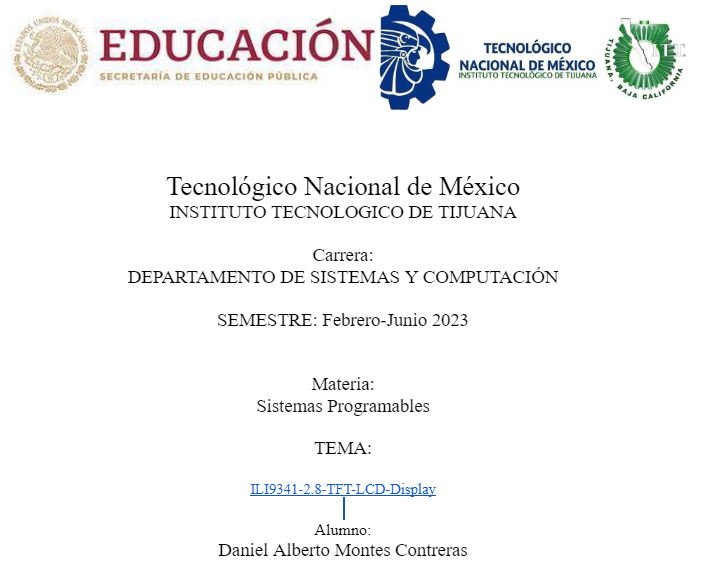
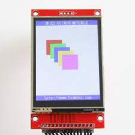
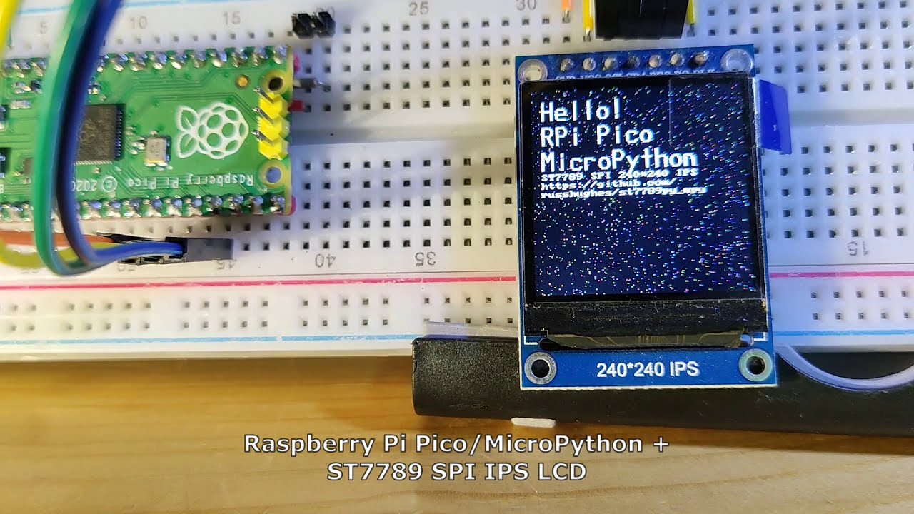

La pantalla TFT-LCD de 2,8' ILI9341 es un módulo de pantalla pequeño y económico que utiliza el chip controlador ILI9341 para controlar una pantalla TFT LCD a color de 2,8 pulgadas (diagonal). Tiene una resolución de 320 x 240 píxeles y admite hasta 262K colores La pantalla se usa comúnmente en sistemas integrados y proyectos de bricolaje donde se requiere una pantalla pequeña y de bajo consumo.

El chip controlador ILI9341 es una opción popular para pantallas TFT-LCD pequeñas debido a su bajo costo, alto rendimiento y amplio soporte en varias bibliotecas y marcos de programación. Utiliza una interfaz paralela para comunicarse con el microcontrolador host y admite varias funciones, como desplazamiento de hardware, visualización parcial y corrección gamma. Con su tamaño pequeño y bajo consumo de energía, la pantalla TFT-LCD de 2,8' ILI9341 es una solución versátil y rentable para muchas aplicaciones de pantallas integradas.

### Codigo ###
~~~
#include "SPI.h"
#include "Adafruit_GFX.h"
#include "Adafruit_ILI9341.h"

#define TFT_DC 9
#define TFT_CS 10
Adafruit_ILI9341 tft = Adafruit_ILI9341(TFT_CS, TFT_DC);
void setup() {
 tft.begin();

  tft.setCursor(26, 120);
  tft.setTextColor(ILI9341_RED);
  tft.setTextSize(3);
  tft.println("Hola Mundo");

  tft.setCursor(20, 160);
  tft.setTextColor(ILI9341_GREEN);
  tft.setTextSize(2);
  tft.println("Texto Verde");
}

void loop() { }
~~~

- Se usa comúnmente en dispositivos portátiles pequeños, como consolas de juegos portátiles, reproductores de MP3 y cámaras digitales.

- La pantalla tiene un amplio ángulo de visión de 160 grados, lo que facilita la lectura desde diferentes ángulos.

- El chip controlador ILI9341 es compatible con una variedad de interfaces de comunicación, que incluyen interfaz RGB, SPI de 3/4 cables y paralelo de 8 bits/16 bits.

- La pantalla tiene una luz de fondo incorporada, que se puede controlar con un pin separado.

- El chip del controlador ILI9341 también admite la entrada táctil a través de un controlador de pantalla táctil separado, que se puede integrar con el módulo de visualización.

- La pantalla es compatible con varios microcontroladores y placas de desarrollo, incluidos Arduino, Raspberry Pi y STM32.

- En general, la pantalla TFT-LCD de 2,8' ILI9341 es un módulo de pantalla versátil y ampliamente utilizado que ofrece alto rendimiento y bajo costo para muchas aplicaciones de pantallas integradas.

- La pantalla tiene una frecuencia de actualización rápida de hasta 60 fotogramas por segundo, lo que la hace adecuada para mostrar gráficos y videos de movimiento rápido.

- El chip controlador ILI9341 también es compatible con funciones avanzadas como la transferencia DMA y la aceleración de hardware, que pueden mejorar aún más el rendimiento de la pantalla.

- La pantalla normalmente funciona con un voltaje de 3,3 V, aunque algunas variantes pueden admitir un rango de voltaje más amplio.

En general, la pantalla TFT-LCD de 2,8' ILI9341 es un módulo de pantalla versátil y ampliamente utilizado que ofrece alto rendimiento y características avanzadas para muchas aplicaciones de pantalla integrada.

[Display de Pantalla](https://wokwi.com/projects/308024602434470466)
